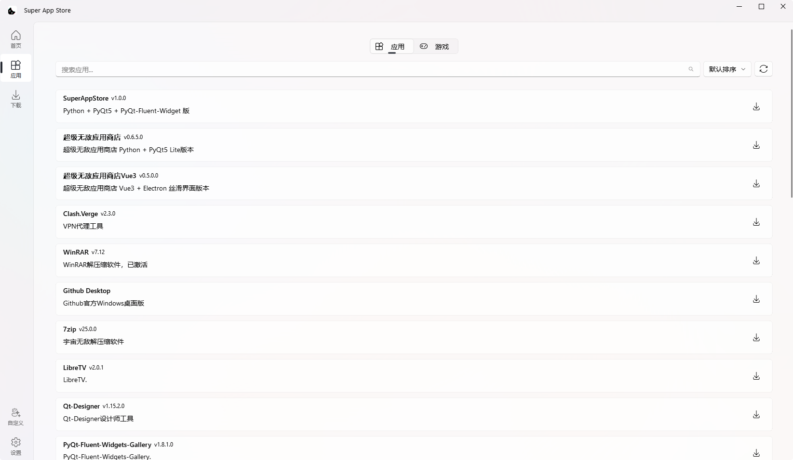
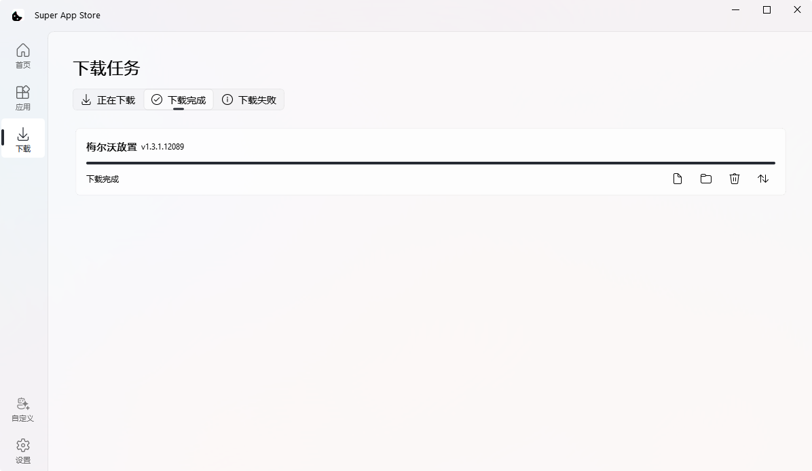
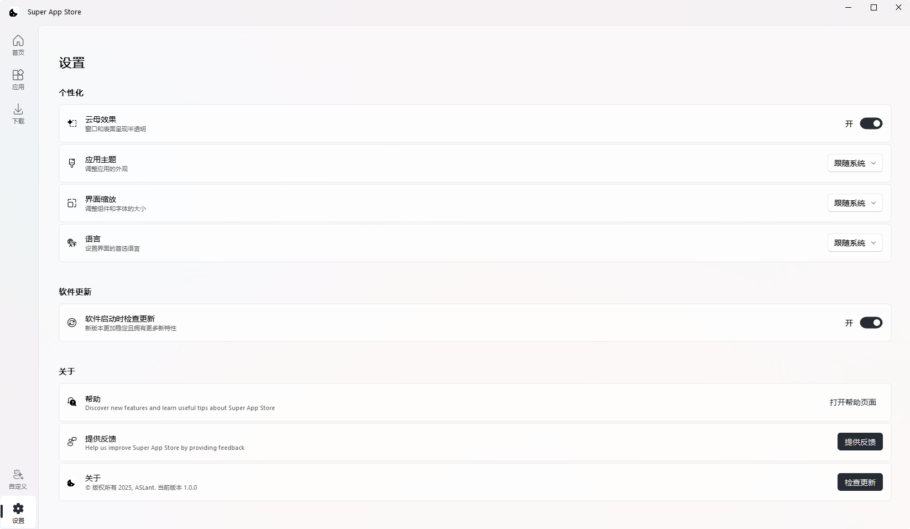

# SuperAppStore 超级应用商店

<div align="center">


*一站式自定义应用源与下载平台*

**⚠️ 项目仍在开发中 ⚠️**

</div>

## 📋 项目简介

SuperAppStore是一个Windows应用商店，专为简化软件获取和管理而设计。它支持多种软件源接入方式，包括自定义服务器JSON列表和GitHub Release，让用户可以轻松获取和更新各类应用程序。

## ✨ 主要特性

- 📦 多源支持：接入自定义服务器JSON软件列表
- 🔗 GitHub集成：自动获取并安装GitHub Release发布的应用
- 🚀 一键安装与快速部署
- 🔄 应用自动更新检测与提醒
- 🛡️ 软件安全性验证
- 🎨 Fluent设计风格：采用现代化的微软Fluent UI设计语言
- 🌓 主题切换：支持深色/浅色主题模式
- 📱 用户友好的界面与操作流程

## 📷 界面展示

<div align="center">
  <p><em>⚠️ 以下界面仍在开发中，非最终效果 ⚠️</em></p>
  
  
  <p>登录界面</p>
  
  <table width="100%">
    <tr>
      <td align="center" width="50%">
        
        <p>应用列表界面</p>
      </td>
      <td align="center" width="50%">
        
        <p>下载界面</p>
      </td>
    </tr>
    <tr>
      <td align="center" width="50%">
        
        <p>下载完成界面</p>
      </td>
      <td align="center" width="50%">
        
        <p>设置界面</p>
      </td>
    </tr>
  </table>
</div>

## 🔧 软件源支持

### 自定义服务器

- 支持通过JSON格式配置的软件源列表
- 可自定义服务器地址和认证信息
- 支持软件分类和筛选

### GitHub Release集成

- 手动添加GitHub仓库以追踪最新发布
- 自动检测新版本并提供更新
- 支持资源文件选择性下载

## 🛠️ 安装指南

### 前提条件

- Python 3.8+
- [uv](https://github.com/astral-sh/uv) 包管理工具

### 安装步骤

1. **创建虚拟环境**

```bash
uv venv
```

2. **激活虚拟环境**

```bash
# Windows
.venv\Scripts\activate

# Linux/MacOS
source .venv/bin/activate
```

3. **安装依赖**

```bash
uv sync
```

## 🚀 使用方法

启动应用程序：

```bash
uv run main.py
```

### 构建独立可执行文件

```bash
pyinstaller --name "SuperAppStore" --noconfirm --clean --windowed --onedir --contents-directory Lib --icon="App.ico" main.py
```
或者  

```bash
uv run win.py
``` 

## 📝 许可证

MIT © SuperAppStore 团队

## 🤝 贡献指南

欢迎提交问题和拉取请求！
